# EstateFlow — Documentación del Proyecto Final de Máster

**Proyecto Final del Máster en Desarrollo Full Stack**
**Aplicación: EstateFlow — Plataforma SaaS de Gestión de Comunidades**

---

## Índice

1. [Definición del problema](#1-definición-del-problema)
2. [Reflexión: aportación y eficiencia](#2-reflexión-aportación-y-eficiencia)
3. [Listado de tecnologías utilizadas](#3-listado-de-tecnologías-utilizadas)
4. [Definición de tipos de usuarios](#4-definición-de-tipos-de-usuarios)
5. [Casos de uso](#5-casos-de-uso)
6. [Seguridad y protección de datos](#6-seguridad-y-protección-de-datos)
7. [Arquitectura y diagramas](#7-arquitectura-y-diagramas)
8. [Modelo de datos (diagrama ER)](#8-modelo-de-datos-diagrama-er)
9. [Máquina de estados de incidencias](#9-máquina-de-estados-de-incidencias)
10. [API REST — Endpoints](#10-api-rest--endpoints)
11. [Estructura del proyecto](#11-estructura-del-proyecto)
12. [Guía de instalación y despliegue](#12-guía-de-instalación-y-despliegue)
13. [Capturas de pantalla](#13-capturas-de-pantalla)

---

## 1. Definición del problema

### Contexto

La gestión de comunidades residenciales en España (urbanizaciones, complejos de viviendas, comunidades de propietarios) se realiza en gran medida mediante procesos manuales: llamadas telefónicas, mensajes de WhatsApp, papel físico en los tablones de anuncios y visitas presenciales a la oficina de administración. Esto genera ineficiencias, pérdida de información y falta de trazabilidad.

### Carencias detectadas

- **Incidencias sin trazabilidad**: Los residentes reportan problemas (fugas, luces rotas, ascensores averiados) mediante llamadas o WhatsApp. No hay registro formal, ni seguimiento de estado, ni tiempos de resolución.
- **Reservas de instalaciones conflictivas**: Las reservas de pistas de pádel, salón social o piscina se hacen por teléfono o en papel, generando solapamientos y disputas entre vecinos.
- **Paquetería sin control**: Los paquetes recibidos en portería se anotan en papel. No hay notificación al residente ni registro de entrega.
- **Accesos de visitantes no gestionados**: La autorización de visitas, proveedores y trabajadores se hace de forma verbal, sin registro ni control.
- **Obras sin supervisión**: Las obras en viviendas se comunican informalmente, sin control de horarios, empresas o trabajadores.
- **Falta de transparencia**: Los residentes no tienen visibilidad sobre el estado de sus solicitudes ni sobre la actividad general de la comunidad.

### Impacto

- **Pérdida de tiempo** para residentes y personal de administración
- **Falta de respuesta** ante incidencias críticas (fugas, ascensores)
- **Conflictos entre vecinos** por reservas solapadas
- **Pérdida de paquetes** sin trazabilidad
- **Problemas de seguridad** por accesos no controlados
- **Imposibilidad de medir** la calidad del servicio (tiempos de resolución, volumen de incidencias)

### Solución propuesta

**EstateFlow** es una plataforma SaaS que digitaliza y centraliza toda la operativa de una comunidad residencial:

- **Portal del residente**: Cada vecino puede reportar incidencias, reservar instalaciones, autorizar visitas, registrar obras y consultar su paquetería desde una interfaz web.
- **Panel de operativa**: El personal de la comunidad (porteros, mantenimiento) gestiona incidencias, registra paquetes, controla accesos y visualiza la actividad en tiempo real.
- **Panel de administración**: El administrador tiene acceso global, gestiona usuarios, visualiza KPIs y controla todo el sistema.
- **Notificaciones automáticas**: Los usuarios reciben notificaciones cuando hay cambios en sus incidencias, paquetes recibidos o reservas confirmadas.

---

## 2. Reflexión: aportación y eficiencia

### Cómo la herramienta mejora los procesos

| Proceso | Antes (manual) | Después (EstateFlow) |
|---|---|---|
| **Reportar incidencia** | Llamada telefónica o WhatsApp al administrador | Formulario web con categoría, urgencia y ubicación. Trazabilidad completa |
| **Seguir estado de incidencia** | Llamar para preguntar | Panel en tiempo real con estados: Abierta → En progreso → Resuelta |
| **Reservar instalación** | Papel en portería o llamada | Reserva online con validación automática de solapamientos |
| **Recoger paquetes** | Lista en papel, aviso verbal | Registro digital con transportista, tracking y estado de entrega |
| **Autorizar visita** | Llamada a portería | Formulario web con nombre, DNI y fecha. Visible para seguridad |
| **Registrar obra** | Notificación informal | Formulario con fechas, empresa y número de trabajadores |
| **Medir calidad del servicio** | Imposible | KPIs automáticos: total, abiertas, resueltas, tiempo medio de resolución |

### Tareas automatizadas

- **Validación de solapamientos** en reservas: el sistema comprama automáticamente que no exista otra reserva en el mismo horario
- **Máquina de estados** en incidencias: solo se permiten transiciones válidas (Abierta → En progreso → Resuelta)
- **Refresh automático de tokens JWT**: el frontend renueva el token de acceso sin que el usuario tenga que volver a iniciar sesión
- **Notificaciones automáticas**: se generan notificaciones cuando se asignan incidencias, reciben paquetes o se confirman reservas
- **Filtrado por rol**: la API devuelve automáticamente solo los datos relevantes para cada usuario

### Beneficios aportados

- **Transparencia total**: residentes, personal y administración tienen visibilidad del estado de cada proceso
- **Trazabilidad completa**: cada incidencia tiene registro de quién la creó, quién la asignó y cuándo se resolvió
- **Reducción de conflictos**: las reservas se validan automáticamente, eliminando solapamientos
- **Trazabilidad de paquetes**: registro de recepción y entrega con transportista y número de tracking
- **Control de accesos**: registro formal de visitantes autorizados con DNI
- **Métricas de calidad**: KPIs que permiten medir y mejorar el servicio
- **Accesibilidad 24/7**: disponible desde cualquier dispositivo con navegador

---

## 3. Listado de tecnologías utilizadas

### Backend (obligatorio)

| Tecnología | Versión | Justificación |
|---|---|---|
| **Python** | 3.12+ | Lenguaje principal del backend |
| **Django** | 5.0.7 | Framework web robusto con ORM, autenticación, admin y sistema de plantillas |
| **Django REST Framework** | 3.16.1 | Para construir la API REST consumida por el frontend React |
| **djangorestframework-simplejwt** | 5.3.1 | Autenticación JWT con tokens de acceso y refresco |
| **django-cors-headers** | 4.9.0 | Gestión de CORS para permitir peticiones desde el frontend |
| **SQLite** | (integrado) | Base de datos de desarrollo. Preparado para PostgreSQL en producción |
| **Pillow** | 12.1.1 | Procesamiento de imágenes para incidencias |
| **gunicorn** | 21.2.0 | Servidor WSGI para producción en Render |

### Frontend (parcialmente obligatorio)

| Tecnología | Versión | Justificación |
|---|---|---|
| **React** | 19 | Framework de UI por componentes con hooks |
| **TypeScript** | 5.7+ | Tipado estático para mayor robustez y mantenibilidad |
| **Vite** | 8.0 | Build tool rápido con HMR y tree-shaking |
| **React Router** | 7 | Enrutamiento SPA con guards por rol |
| **Tailwind CSS** | 4.0 | Framework CSS utility-first con design system custom |
| **Framer Motion** | 11 | Animaciones fluidas y discretas (fade, slide, scale) |
| **Lucide React** | 0.460 | Iconografía consistente y ligera |
| **class-variance-authority** | 0.7 | Variantes de componentes tipadas |
| **clsx + tailwind-merge** | 2.x | Utilidad para merge de clases CSS |

### DevOps y despliegue

| Tecnología | Justificación |
|---|---|
| **Git + GitHub** | Control de versiones con repositorio público y commits significativos |
| **Render** | Despliegue del backend Django (PaaS con soporte Python) |
| **GitHub Pages** | Despliegue del frontend React (estático, CI/CD con GitHub Actions) |
| **GitHub Actions** | CI/CD automático para build y deploy del frontend |

---

## 4. Definición de tipos de usuarios

### Roles del sistema

El sistema define tres roles con permisos diferenciados:

#### USER (Residente)
- **Descripción**: Propietario o inquilino de una vivienda en la urbanización
- **Permisos**:
  - Reportar incidencias
  - Ver y seguir sus propias incidencias
  - Reservar instalaciones comunes
  - Ver sus reservas
  - Autorizar accesos de visitantes
  - Registrar obras en su vivienda
  - Consultar su paquetería
  - Ver sus notificaciones
  - Ver y editar su perfil

#### STAFF (Personal operativo)
- **Descripción**: Personal de la urbanización (porteros, mantenimiento, seguridad)
- **Permisos**:
  - Todo lo del USER excepto reservar y registrar obras
  - Ver todas las incidencias de la urbanización
  - Cambiar estado de incidencias (Abierta → En progreso → Resuelta)
  - Asignarse incidencias
  - Registrar paquetes recibidos
  - Marcar paquetes como entregados
  - Ver todos los accesos autorizados
  - Ver todas las obras registradas
  - Ver panel operativo con KPIs

#### ADMIN (Administrador)
- **Descripción**: Administrador de la comunidad con acceso total
- **Permisos**:
  - Todo lo del STAFF
  - Gestionar usuarios (cambiar roles, activar/desactivar)
  - Ver dashboard global con métricas
  - Acceso al panel de administración de Django (/admin/)
  - Acceso a todas las funcionalidades del sistema

### Modelo de datos del usuario

```
User (AbstractUser)
├── username (heredado)
├── email (heredado)
├── password (hash PBKDF2)
├── role: ADMIN | STAFF | USER
├── tipo_usuario: PROPIETARIO | INQUILINO | PERSONAL
├── vivienda: FK → Vivienda (nullable)
└── is_active: boolean
```

---

## 5. Casos de uso

### Caso de uso 1: Residente reporta incidencia

**Actor**: USER (residente)
**Flujo**:
1. El residente inicia sesión en el portal
2. Navega a "Incidencias"
3. Rellena el formulario: título, descripción, categoría, ubicación, urgencia
4. Envía el formulario
5. El sistema crea la incidencia con estado "Abierta"
6. El residente ve la incidencia en su lista
7. El personal recibe la incidencia en su panel

**Resultado**: Incidencia registrada con trazabilidad completa
**Errores posibles**: Validación de campos obligatorios, validación de categoría

### Caso de uso 2: Staff cambia estado de incidencia

**Actor**: STAFF
**Flujo**:
1. El personal inicia sesión en el panel operativo
2. Navega a "Incidencias"
3. Ve todas las incidencias de la urbanización
4. Selecciona una incidencia abierta
5. Cambia el estado a "En progreso" (se asigna automáticamente)
6. Cuando termina, cambia a "Resuelta" (requiere técnico asignado)

**Resultado**: Incidencia actualizada con máquina de estados válida
**Errores posibles**: Transición inválida (ej. Resuelta → Abierta), resolver sin asignar

### Caso de uso 3: Residente reserva instalación

**Actor**: USER
**Flujo**:
1. El residente navega a "Reservas"
2. Selecciona una instalación disponible
3. Elige fecha y hora
4. El sistema valida que no haya solapamiento
5. Si es válido, crea la reserva
6. El residente ve la reserva en su lista

**Resultado**: Reserva confirmada sin solapamientos
**Errores posibles**: Solapamiento con otra reserva, instalación inactiva

### Caso de uso 4: Staff registra paquete

**Actor**: STAFF
**Flujo**:
1. El personal recibe un paquete en portería
2. Navega a "Paquetes" en el panel operativo
3. Rellena: residente destinatario, transportista, número de tracking, descripción
4. El sistema crea el paquete con estado "Pendiente"
5. El residente ve el paquete en su portal
6. Cuando el residente recoge el paquete, el staff marca como "Entregado"

**Resultado**: Paquete registrado con trazabilidad de recepción y entrega
**Errores posibles**: Residente no encontrado, campos obligatorios vacíos

### Caso de uso 5: Admin gestiona usuarios

**Actor**: ADMIN
**Flujo**:
1. El administrador navega a "Gestión de usuarios"
2. Ve la lista completa de usuarios con rol y estado
3. Puede cambiar el rol de un usuario (USER → STAFF, etc.)
4. Puede activar o desactivar un usuario
5. El cambio se refleja inmediatamente

**Resultado**: Usuario actualizado con nuevos permisos
**Errores posibles**: Usuario no encontrado, intento de desactivarse a sí mismo

### Caso de uso 6: Residente autoriza visita

**Actor**: USER
**Flujo**:
1. El residente navega a "Accesos"
2. Rellena: nombre del visitante, DNI (opcional), fecha de visita
3. El sistema crea la autorización
4. El personal de seguridad ve la autorización en su panel

**Resultado**: Visitante autorizado con registro formal
**Errores posibles**: Campos obligatorios vacíos, fecha pasada

---

## 6. Seguridad y protección de datos

### Autenticación

- **JWT (JSON Web Tokens)** mediante SimpleJWT
  - Token de acceso: válido 2 horas
  - Token de refresco: válido 1 día
  - Renovación automática en el frontend sin re-login
- **Autenticación por sesiones** para vistas Django (login, admin) con CSRF protection
- **Hashing de contraseñas** mediante PBKDF2 (sistema de Django)
- **Validadores de contraseñas**: similitud con datos del usuario, longitud mínima, contraseñas comunes, contraseñas numéricas

### Autorización

- **Permisos por rol** en cada endpoint de la API:
  - `IsAuthenticated` en todas las rutas
  - Comprobación de `role` en vistas restringidas (STAFF/ADMIN)
- **RoleGuard** en frontend: las rutas no accesibles redirigen al dashboard
- **ProtectedRoute**: las rutas privadas requieren autenticación
- **Filtrado por usuario**: los residentes solo ven sus propios datos

### Protección contra ataques

| Medida | Implementación |
|---|---|
| **CSRF** | `CsrfViewMiddleware` activado para vistas Django con formularios |
| **XSS** | Django escapa automáticamente plantillas. React escapa por defecto |
| **Clickjacking** | `XFrameOptionsMiddleware` con `DENY` |
| **CORS** | Orígenes específicos permitidos (no wildcard) |
| **HTTPS** | `SECURE_SSL_REDIRECT` activo en producción |
| **HSTS** | `SECURE_HSTS_SECONDS = 31536000` en producción |
| **Cookies seguras** | `SESSION_COOKIE_SECURE` y `CSRF_COOKIE_SECURE` en producción |
| **SQL Injection** | ORM de Django con queries parametrizadas |
| **Secretos** | `SECRET_KEY` y `DEBUG` mediante variables de entorno |

### Configuración de producción

```python
DEBUG = False  # Via env var
SECURE_SSL_REDIRECT = True
SECURE_HSTS_SECONDS = 31536000
SECURE_HSTS_INCLUDE_SUBDOMAINS = True
SESSION_COOKIE_SECURE = True
CSRF_COOKIE_SECURE = True
CORS_ALLOWED_ORIGINS = ["https://jstack-dev.github.io"]  # Solo el frontend
```

### Gestión de secretos

- `DJANGO_SECRET_KEY`: variable de entorno (no hardcodeada)
- `DJANGO_DEBUG`: variable de entorno (False en producción)
- `CORS_ALLOWED_ORIGINS`: variable de entorno
- `VITE_API_URL`: variable de entorno del frontend
- Tokens JWT almacenados en `localStorage` (no en cookies para evitar CSRF en API)

---

## 7. Arquitectura y diagramas

### Diagrama de arquitectura

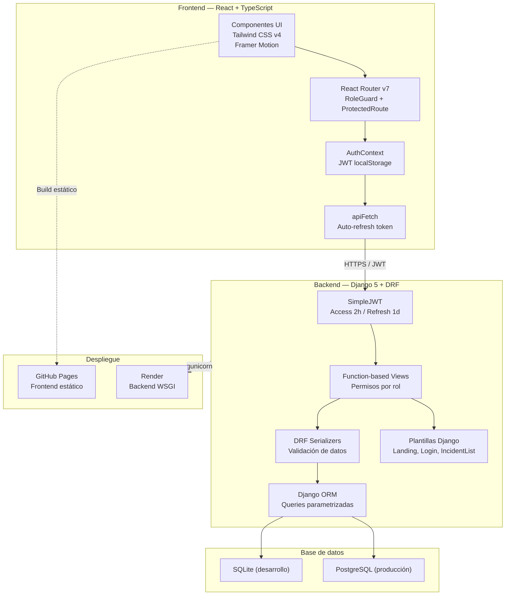

### Diagrama de casos de uso (UML)

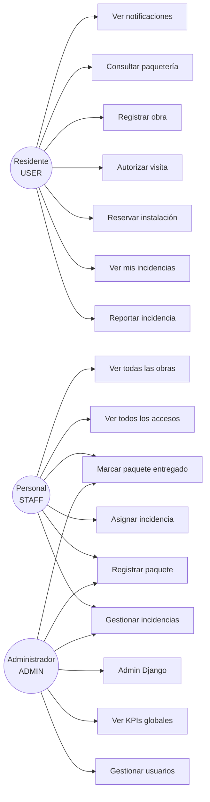

---

## 8. Modelo de datos (diagrama ER)

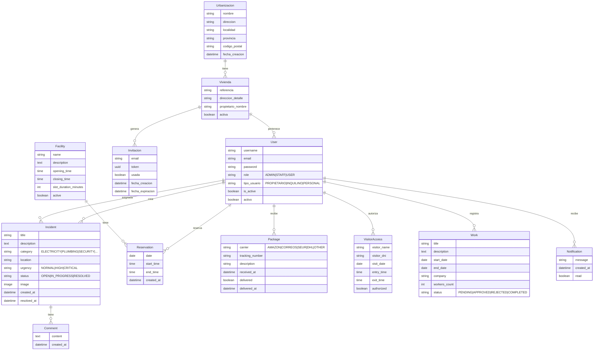

---

## 9. Máquina de estados de incidencias

El modelo `Incident` implementa una máquina de estados estricta que solo permite transiciones válidas. La validación se realiza en el método `clean()` del modelo y se ejecuta automáticamente antes de cada `save()`.

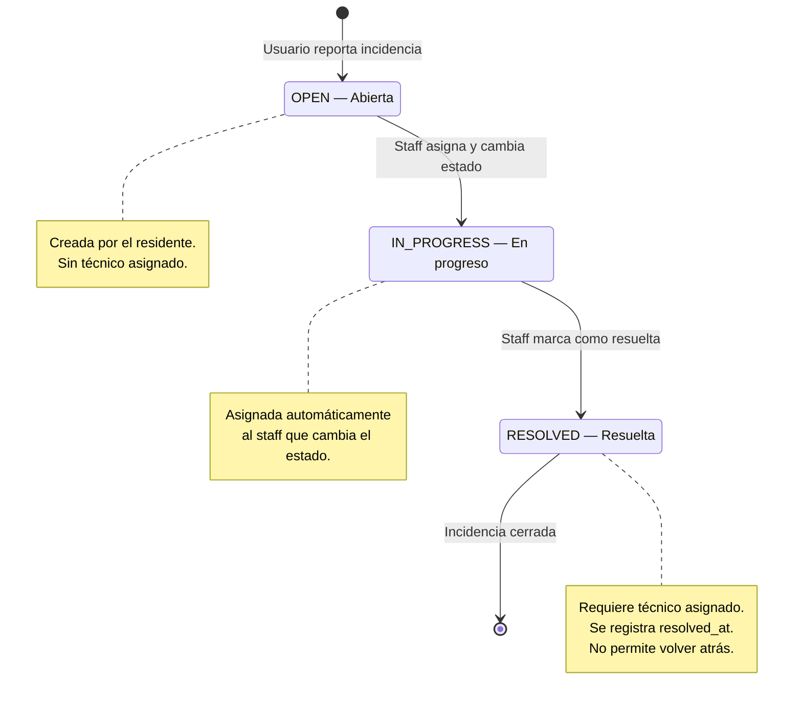

**Transiciones permitidas:**

| Estado actual | Estados permitidos |
|---|---|
| `OPEN` | `IN_PROGRESS` |
| `IN_PROGRESS` | `RESOLVED` |
| `RESOLVED` | *(ninguno — estado terminal)* |

**Validaciones adicionales:**
- No se puede resolver una incidencia sin técnico asignado
- Al resolver, se registra automáticamente `resolved_at = now()`
- Si se revierte el estado (no permitido en producción), se limpia `resolved_at`

---

## 10. API REST — Endpoints

### Autenticación JWT

| Método | Endpoint | Descripción | Auth |
|---|---|---|---|
| `POST` | `/api/token/` | Obtener token de acceso y refresco | Público |
| `POST` | `/api/token/refresh/` | Renovar token de acceso | Refresh token |
| `POST` | `/api/auth/login/` | Login personalizado (devuelve JWT) | Público |
| `POST` | `/api/auth/register/` | Registro de nuevo usuario | Público |
| `GET` | `/api/auth/me/` | Datos del usuario autenticado | JWT |

### Gestión de usuarios (solo ADMIN)

| Método | Endpoint | Descripción | Auth |
|---|---|---|---|
| `GET` | `/api/users/` | Listar todos los usuarios | ADMIN |
| `PATCH` | `/api/users/<id>/` | Actualizar rol o estado de un usuario | ADMIN |

### Incidencias

| Método | Endpoint | Descripción | Auth |
|---|---|---|---|
| `GET` | `/api/incidents/` | Listar incidencias (filtradas por rol) | JWT |
| `POST` | `/api/incidents/` | Crear nueva incidencia | JWT |
| `PATCH` | `/api/incidents/<id>/` | Actualizar estado / asignar | JWT |
| `GET` | `/api/incidents/stats/` | KPIs: total, abiertas, resueltas, media | STAFF/ADMIN |

### Reservas

| Método | Endpoint | Descripción | Auth |
|---|---|---|---|
| `GET` | `/api/reservations/` | Listar reservas del usuario | JWT |
| `POST` | `/api/reservations/` | Crear reserva (valida solapamientos) | JWT |
| `GET` | `/api/reservations/facilities/` | Listar instalaciones disponibles | JWT |

### Paquetería

| Método | Endpoint | Descripción | Auth |
|---|---|---|---|
| `GET` | `/api/packages/resident/` | Paquetes del residente autenticado | JWT |
| `GET` | `/api/packages/staff/` | Todos los paquetes (staff/admin) | STAFF/ADMIN |
| `POST` | `/api/packages/staff/` | Registrar nuevo paquete | STAFF/ADMIN |
| `PATCH` | `/api/packages/deliver/<id>/` | Marcar paquete como entregado | STAFF/ADMIN |

### Accesos

| Método | Endpoint | Descripción | Auth |
|---|---|---|---|
| `GET` | `/api/access/resident/` | Accesos autorizados del residente | JWT |
| `POST` | `/api/access/resident/` | Autorizar nueva visita | JWT |
| `GET` | `/api/access/staff/` | Todos los accesos (staff/admin) | STAFF/ADMIN |

### Obras

| Método | Endpoint | Descripción | Auth |
|---|---|---|---|
| `GET` | `/api/works/resident/` | Obras del residente | JWT |
| `POST` | `/api/works/resident/` | Registrar nueva obra | JWT |
| `GET` | `/api/works/staff/` | Todas las obras (staff/admin) | STAFF/ADMIN |

### Notificaciones

| Método | Endpoint | Descripción | Auth |
|---|---|---|---|
| `GET` | `/api/notifications/resident/` | Últimas 10 notificaciones del usuario | JWT |

### Vistas Django (plantillas)

| URL | Vista | Plantilla | Auth |
|---|---|---|---|
| `/` | `TemplateView` | `landing.html` | Público |
| `/login/` | `LoginView` | `registration/login.html` | Público |
| `/logout/` | `LogoutView` | — | Sesión |
| `/incidents/` | `incident_list` | `incidents/incident_list.html` | Sesión |
| `/admin/` | `admin.site` | Django Admin | Superuser |

---

## 11. Estructura del proyecto

```
issueflow/
├── issueflow/                 # Configuración principal de Django
│   ├── settings.py            # Settings con JWT, CORS, CSRF, security
│   ├── urls.py                # URL routing: API + plantillas Django
│   └── wsgi.py                # WSGI para producción (gunicorn)
│
├── users/                     # App: autenticación y gestión de usuarios
│   ├── models.py              # User custom (AbstractUser + role + tipo)
│   ├── views.py               # login_api, register_api, current_user, CRUD
│   ├── serializers.py         # UserSerializer
│   ├── urls.py                # /api/auth/*
│   └── management_urls.py     # /api/users/* (admin)
│
├── estructura/                # App: estructura de la urbanización
│   ├── models.py              # Urbanizacion, Vivienda, Invitacion
│   ├── views.py               # incident_list (vista Django con plantilla)
│   └── management/
│       └── commands/
│           └── seed_data.py   # Comando para cargar datos de demo
│
├── incidents/                 # App: gestión de incidencias
│   ├── models.py              # Incident con máquina de estados
│   ├── views.py               # API CRUD + stats + vista Django
│   ├── serializers.py         # IncidentSerializer con validación
│   └── urls.py                # /api/incidents/*
│
├── reservations/              # App: reservas de instalaciones
│   ├── models.py              # Facility, Reservation (valida solapamientos)
│   ├── views.py               # API list/create + facilities
│   └── urls.py                # /api/reservations/*
│
├── packages/                  # App: paquetería
│   ├── models.py              # Package con transportistas
│   ├── views.py               # API resident + staff + deliver
│   └── urls.py                # /api/packages/*
│
├── access/                    # App: control de accesos
│   ├── models.py              # VisitorAccess
│   ├── views.py               # API resident + staff
│   └── urls.py                # /api/access/*
│
├── works/                     # App: obras en viviendas
│   ├── models.py              # Work con estados (pending/approved/...)
│   ├── views.py               # API resident + staff
│   └── urls.py                # /api/works/*
│
├── notifications/             # App: notificaciones
│   ├── models.py              # Notification
│   ├── views.py               # API resident
│   └── urls.py                # /api/notifications/*
│
├── comments/                  # App: comentarios en incidencias
│   ├── models.py              # Comment
│   └── ...
│
├── templates/                 # Plantillas Django (requisito PFM)
│   ├── landing.html           # Landing page profesional
│   ├── registration/
│   │   └── login.html         # Login con sesiones Django
│   └── incidents/
│       └── incident_list.html # Listado de incidencias con plantilla
│
├── frontend/                  # Frontend React + TypeScript
│   ├── src/
│   │   ├── components/ui/     # Design system: Button, Card, Badge, Table...
│   │   ├── hooks/             # useAuth, useApi
│   │   ├── lib/               # utils (cn, apiClient)
│   │   ├── pages/             # LoginPage, AdminDashboard, UserManagement
│   │   ├── portal/pages/      # Inicio, Incidencias, Reservas, Paqueteria...
│   │   ├── operativa/pages/   # Panel, Incidencias, Paquetes, Accesos...
│   │   ├── types/             # Tipos TypeScript de la API
│   │   ├── App.tsx            # Router con RoleGuard
│   │   └── main.tsx           # Entry point
│   ├── vite.config.ts         # Vite con base dinámica dev/prod
│   ├── tsconfig.json          # TypeScript estricto
│   └── package.json           # Dependencias frontend
│
├── requirements.txt           # Dependencias Python
├── manage.py                  # Management de Django
├── DOCUMENTACION.md           # Este documento
├── DEMO.md                    # Guía de demostración con credenciales
└── README.md                  # README del repositorio
```

---

## 12. Guía de instalación y despliegue

### Requisitos previos

- Python 3.12+
- Node.js 20+
- Git

### Instalación local — Backend

```bash
# 1. Clonar el repositorio
git clone https://github.com/JStack-Dev/EstateFlow-Community_Management_Platform.git
cd EstateFlow-Community_Management_Platform

# 2. Crear entorno virtual
python -m venv venv

# 3. Activar entorno virtual
# Windows:
venv\Scripts\activate
# Linux/Mac:
source venv/bin/activate

# 4. Instalar dependencias
pip install -r requirements.txt

# 5. Migraciones
python manage.py migrate

# 6. Cargar datos de demostración
python manage.py seed_data

# 7. Crear superusuario (opcional, el seed ya crea un admin)
python manage.py createsuperuser

# 8. Arrancar servidor
python manage.py runserver
```

El backend estará disponible en `http://localhost:8000/`

### Instalación local — Frontend

```bash
# 1. Entrar al directorio frontend
cd frontend

# 2. Instalar dependencias
npm install

# 3. Crear archivo .env.local
echo "VITE_API_URL=http://localhost:8000" > .env.local

# 4. Arrancar en modo desarrollo
npm run dev
```

El frontend estará disponible en `http://localhost:5173/`

### Build de producción — Frontend

```bash
cd frontend
npm run build
# Genera dist/ con archivos estáticos
```

### Despliegue en Render (Backend)

1. Crear cuenta en [render.com](https://render.com)
2. New → Web Service → Conectar repositorio GitHub
3. Configurar:
   - **Build Command**: `pip install -r requirements.txt && python manage.py migrate`
   - **Start Command**: `gunicorn issueflow.wsgi:application`
   - **Environment Variables**:
     - `DJANGO_SECRET_KEY` = *(clave secreta generada)*
     - `DJANGO_DEBUG` = `False`
     - `DJANGO_ALLOWED_HOSTS` = `estateflow-backend.onrender.com`
     - `CORS_ALLOWED_ORIGINS` = `https://jstack-dev.github.io`
4. Deploy

### Despliegue en GitHub Pages (Frontend)

1. El repositorio incluye GitHub Actions que automáticamente:
   - Ejecuta `npm run build` en cada push a `main`
   - Despliega `dist/` a GitHub Pages
2. Configurar en el repositorio: Settings → Pages → Source: GitHub Actions
3. El frontend estará disponible en:
   `https://<usuario>.github.io/EstateFlow-Community_Management_Platform/`

### Variables de entorno

| Variable | Entorno | Descripción |
|---|---|---|
| `DJANGO_SECRET_KEY` | Backend | Clave secreta de Django |
| `DJANGO_DEBUG` | Backend | `True` en dev, `False` en producción |
| `DJANGO_ALLOWED_HOSTS` | Backend | Hosts permitidos separados por coma |
| `CORS_ALLOWED_ORIGINS` | Backend | Orígenes CORS permitidos (lista JSON) |
| `VITE_API_URL` | Frontend | URL base del backend (sin barra final) |

---

## 13. Capturas de pantalla

> **Nota**: Las capturas deben tomarse con el seed de datos cargado (`python manage.py seed_data`) y ambos servidores corriendo (backend en :8000, frontend en :5173).

### 13.1 Landing page Django

> _Captura de `http://localhost:8000/` — Landing page con hero section, features y footer._


### 13.2 Login React

> _Captura de `http://localhost:5173/` — Pantalla de login del frontend React con branding EstateFlow._

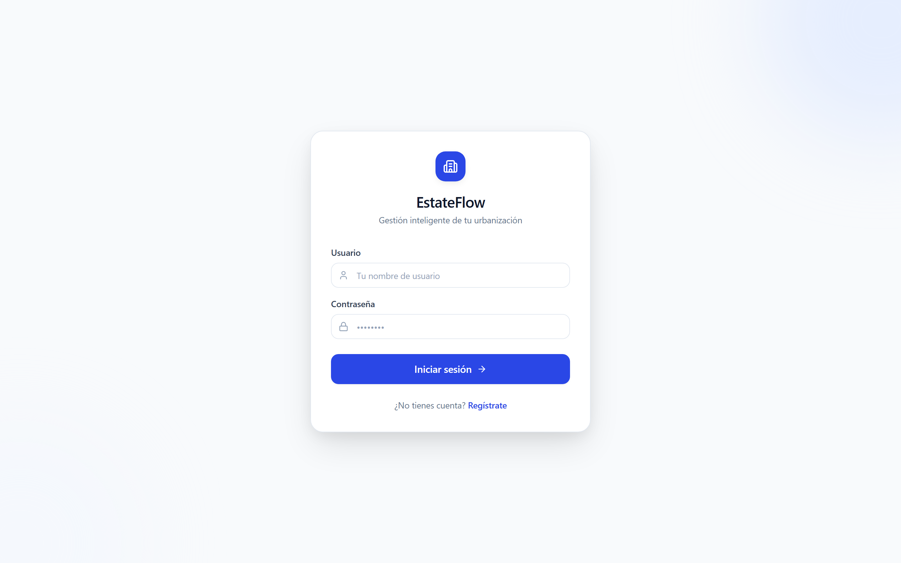

### 13.3 Panel de administración (ADMIN)

> _Captura del dashboard admin con KPIs, alerta de incidencias críticas, tabla de usuarios recientes e incidencias recientes._

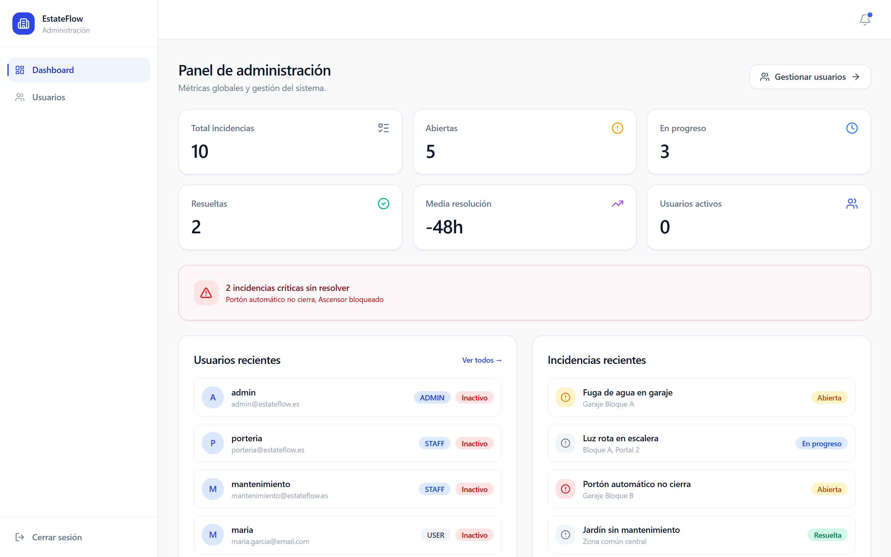

### 13.4 Gestión de usuarios (ADMIN)

> _Captura de la página de gestión de usuarios con tabla, roles y estados._

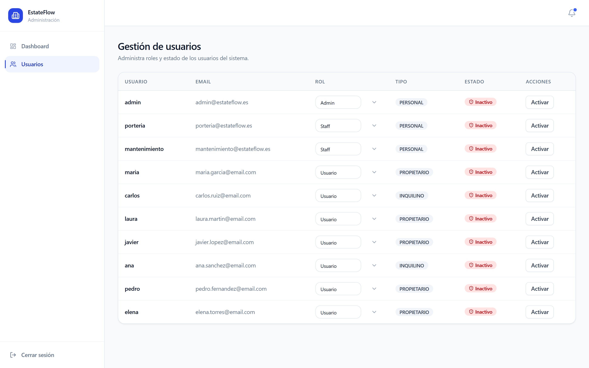

### 13.5 Panel operativo (STAFF)

> _Captura del panel de operativa con métricas, alerta de críticas y tabla de incidencias recientes._

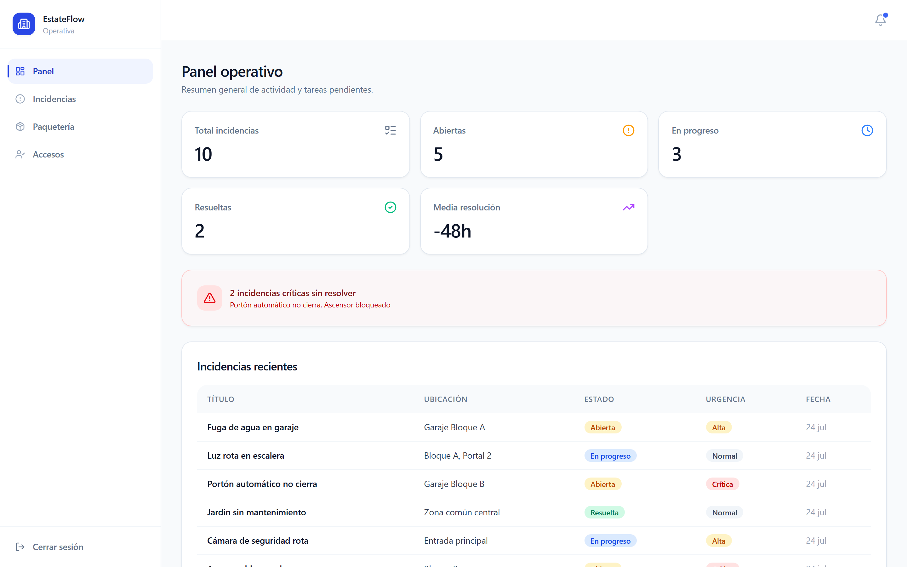

### 13.6 Gestión de incidencias (STAFF)

> _Captura de la lista de incidencias con filtros, badges de estado y urgencia._

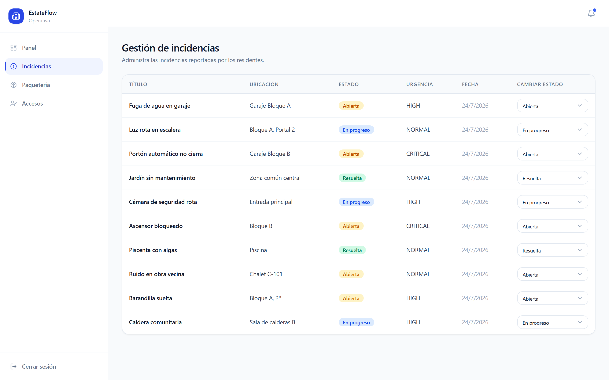

### 13.7 Panel del residente (USER)

> _Captura del dashboard del residente con saludo, stats, acciones rápidas, incidencias recientes, próximas reservas y paquetes pendientes._

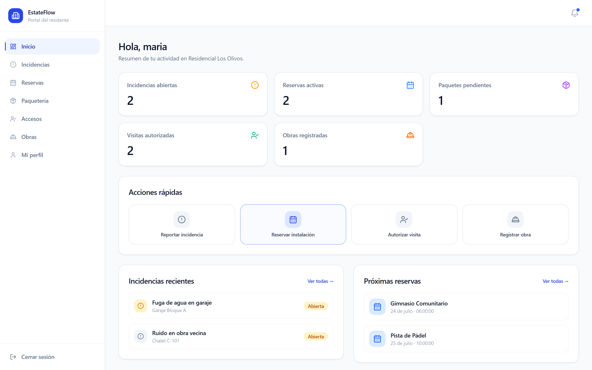

### 13.8 Reportar incidencia (USER)

> _Captura del formulario de nueva incidencia con categoría, ubicación y urgencia._

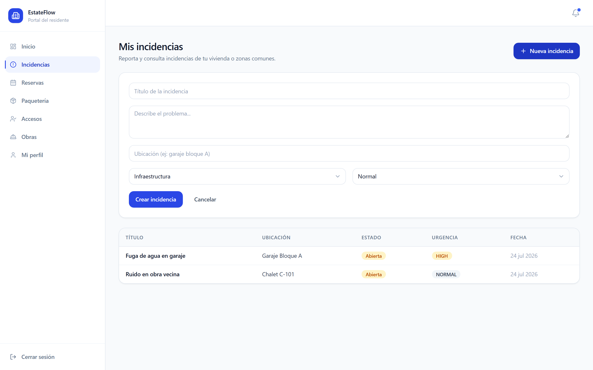

### 13.9 Reserva de instalación (USER)

> _Captura del formulario de reserva con selección de instalación, fecha y hora._

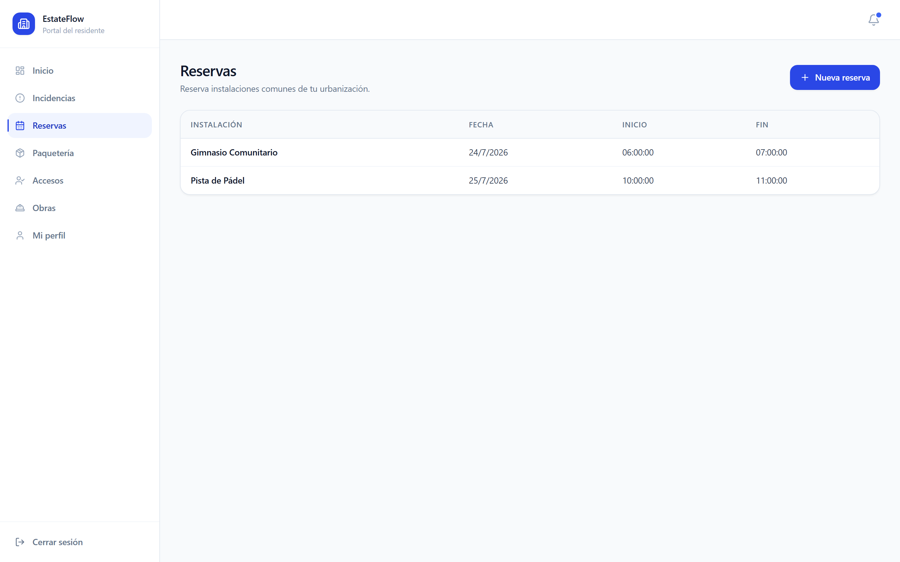

### 13.10 Login Django (sesiones)

> _Captura de `http://localhost:8000/login/` — Login con plantilla Django y CSRF protection._

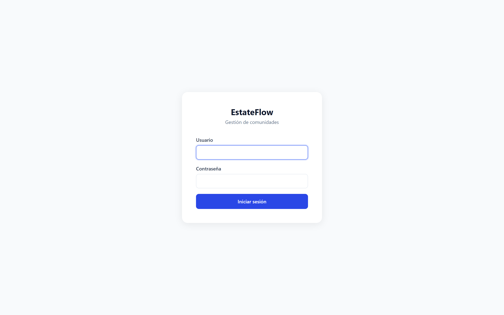

### 13.11 Listado de incidencias Django

> _Captura de `http://localhost:8000/incidents/` — Lista de incidencias con plantilla Django._

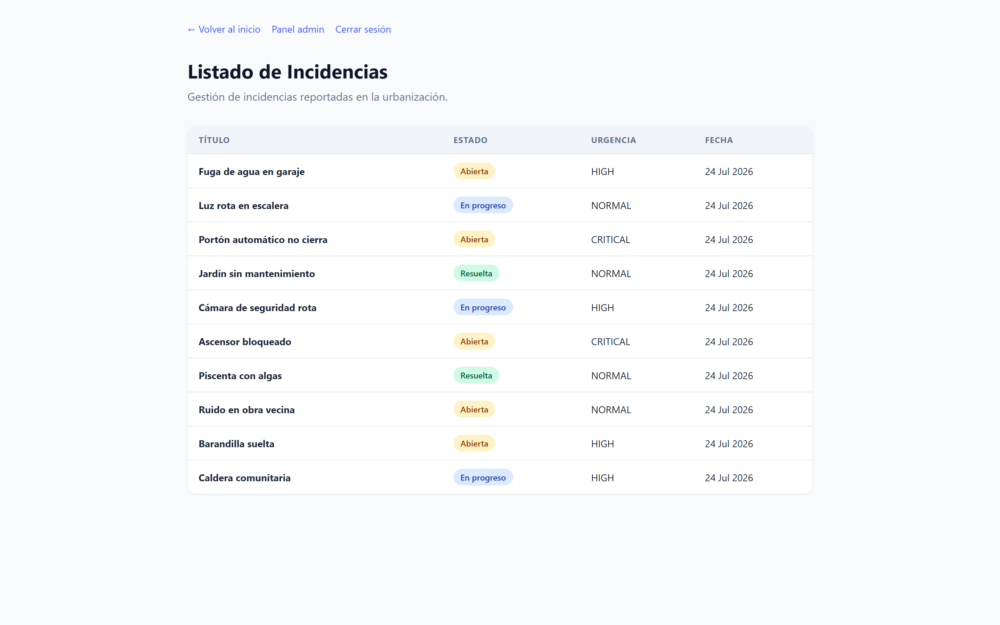

### 13.12 Django Admin

> _Captura de `http://localhost:8000/admin/` — Panel de administración de Django._

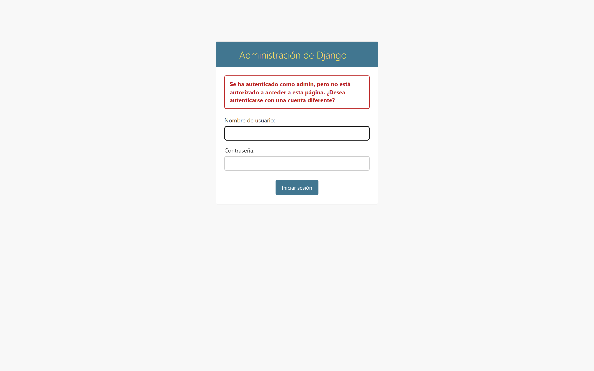

---

*Documentación generada para el Proyecto Final del Máster en Desarrollo Full Stack*
